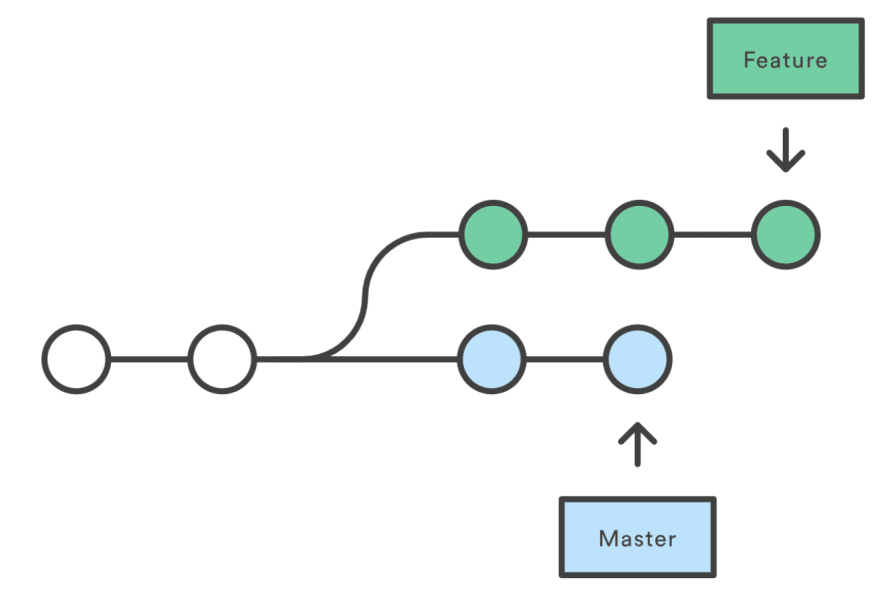

.. _git/branches.rst:

Les branches
############

Le système git permet de travailler simultanément sur plusieurs fonctionnalités
ou dans plusieurs versions différentes du projet grâce aux **branches**.

Dans un historique de versions, une branche est un historique séparé

    Branches d'un projet

..  attention:: 

    Normalement, la branche principale d'un dépôt git s'appelle ``master``.
    Cependant, l'entreprise Microsoft qui possède GitHub, sous la pression
    d'employés antiracistes et suite à l'affaire Georges Floyd aux USA, a décidé
    de changer cette convention en appelant la branche principale ``main``, pour
    ne pas faire référence à l'esclavage.

Listes toutes les branches d'un projet
======================================

Pour lister les branches d'un projet, on utilise la commande

..  code-block:: bash

    git branch

Créer une nouvelle branche locale
=================================

Pour créer une nouvelle branche, il faut 

#.  Se rendre sur la branche sur laquelle on veut baser la nouvelle branche.

    ::

        git checkout base-branch

    Typiquement, dans un workflow simple, on base une nouvelle branche sur la
    branche ``master`` (nommée ``main`` dans les dépôts GitHub récents).

    
#.  Créer la nouvelle branche

    ::

        git checkout -b new-branch

    ..  note::

        L'option ``-b`` demande de créer la branche ``new-branch``

Changer de branche
==================

Pour passer d'une branche à l'autre, il faut utiliser la commande ``git
checkout`` comme suit:

::

    git checkout branche-destination

Pousser une branche locale sur GitHub
=====================================

Si la branche ``feature-branch`` à pousser n'existe pas encore sur le *remote*
(sur GitHub), il faut utiliser l'option ``--set-upstream`` pour la créer sur le
remote

..  code-block:: bash

    git push --set-upstream -u origin feature-branch

Si la branche ``feature-branch`` existe déjà sur le remote, on laisser tomber
l'option ``--set-upstream`` et on fait

..  code-block:: bash

    git push -u origin feature-branch

Tirer une branche du *remote* qui n'existe pas en local
============================================================

Pour travailler en local sur une branche qui existe sur le remote, mais pas en
local, il faut utiliser les commandes suivantes

..  code-block:: bash

    git fetch origin
    git checkout --track origin/<remote_branch_name>

Une fois ceci fait, on peut travailler normalement et pousser les nouveaux
commits effectués sur cette branche avec ``git push``.    