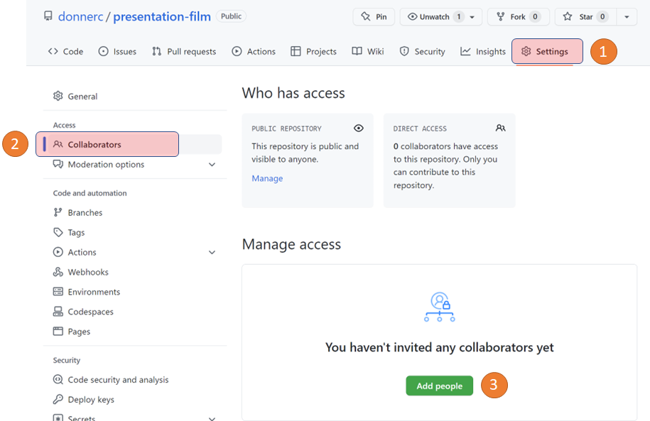
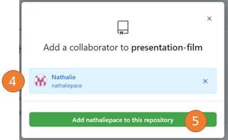

.. _git/collaborer.rst:

Collaborer sur un dépôt Github
##############################

Cette section montre comment utiliser Github et gitpod.io pour collaborer sur un
dépôt avec une autre personne ayant un compte sur Github. Comme exemple, nous
prendrons le dépôt https://github.com/informatiquecsud/projet-html-1gy. Suivez
les instructions avec votre propre dépôt sur lequel vous voulez collaborer.

Partager le dépôt
=================

Pour partager un dépôt Github, il faut se rendre sur le dépôt en question (par
exemple https://github.com/donnerc/presentation-film) et suivre les étapes
suivantes:

    Ajout d'un collaborateur sur le dépôt Github

#.  Cliquer sur **Settings**
 
#.  Cliquer sur **Collaborators**

    ..  admonition:: Remarque

        Il est possible que Github vous demande à ce stade de saisir votre mot
        de passe.
 
#.  Cliquer sur **Add people**

    Ajout du collaborateur
        
#. Dans la boîte de dialogue qui s'ouvre, indiquer le nom d'utilisateur Github
   avec qui vous voulez collaborer.

#. Terminez en cliquant sur le bouton Add XXX to this repository

Travailler sur le dépôt **en même temps**
=========================================

Pour travailler sur le dépôt **en même temps** et collaborer en temps réel, un
des collaborateurs doit ouvrir le dépôt dans Github en rajoutant
``https://gitpod.io#`` tout au début de l'URL dans la barre d'adresse du
navigateur, par exemple
https://gitpod.io#https://github.com/donnerc/presentation-film.

Ensuite, dans gitpod, il doit aller dans menu et cliquer sur **Share running
workspace**, puis **Share** et finalement **Copy URL to clipboard**. Il faut
ensuite partager cette URL avec l'autre personne. Dès qu'elle l'aura collé dans
son navigateur, elle aura accès au même workspace gitpod et elles pourront
collaborer sur le projet en temps réel.

..  figure:: figures/share-gipod-workspace.gif
    :align: center
    :width: 100%

    Partager un workspace gitpod pour collaborer en temps réel sur un même dépôt.

Sauvegarder les modifications sur Github
########################################

Encore une fois, une fois que vous avez apporté des modifications à votre projet
dans gitpod, il faut les sauver dans Github pour les retrouver plus tard.

..  admonition:: Remarque importante

    Les workspaces gratuits gitpod sont des environnement de développement
    **éphémères**. Cela signifie qu'après quelques jours d'inactivité, ils
    seront automatiquement effacés.

    De ce fait, pour ne pas perdre votre travail, il faut le sauvegarder sur
    Github.

Pour sauvegarder votre travail sur Github, ouvrez un nouveau terminal dans
gitpod (Menu view > Terminal) et exécutez-y les commandes suivantes:

..  code-block:: bash

    # ajouter les fichiers à la zone de transit 
    git add .

    # faire le commit (personnaliser le message)
    git commit -m "description des modifications"

    # pousser les modifications sur github
    git push

