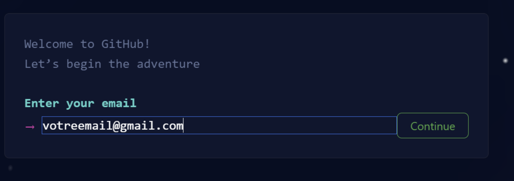
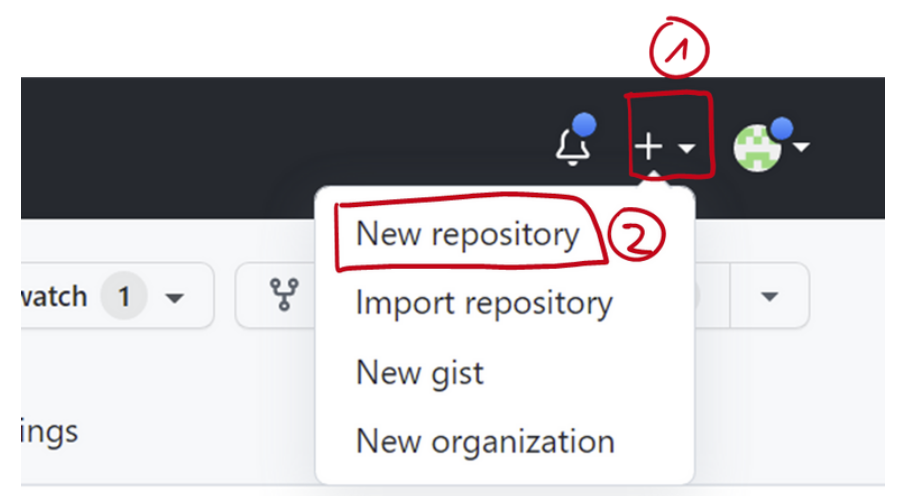

.. _git/create-repo.rst:

Mise en place d'un dépôt git sur GitHub
#######################################

..  note::

    Dans ce tutoriel, vous allez voir comment créer votre dépôt git pour gérer
    le code source de l'application `vue-todo` que nous allons développer pour
    présenter les principales fonctionnalités de VueJS.

Activité 1
==========

Rendez-vous sur le site https://github.com/ et créez-vous un compte en cliquant
sur le bouton **Sign Up** en utilisant *votre courriel privé*.

    Bouton pour se créer un compte sur Github

Inscrivez votre courriel **privé** (et non celui de l'école)

Activité 2
==========

Sur votre nouveau compte GitHub, créez un nouveau dépôt nommé
``vue-todo``.

    Création d'un nouveau dépôt (*repository* en anglais) sur Github

Une fois ceci 

Activité 3
==========

Ouvrez ensuite votre nouveau dépôt ``vue-todo`` sur la plateforme
https://gitpod.io/ qui vous permettra de modifier votre dépôt, d'y rajouter des
fichiers et de modifier leur contenu.

Pour ce faire, visitez la page d'accueil de votre dépôt sur Github et, dans la
barre d'adresse,  rajoutez les caractères ``gipod.io#`` (ne pas oublier le ``#``
à la fin) devant l'URL de votre dépôt Github.

..  admonition:: Exemple

    L'animation ci-dessous montre comment ouvrir le dépôt
    https://github.com/donnerc/presentation-film dans gitpod. Pour ouvrir ce
    dépôt, il suffit de rajouter ``https://gitpod.io#`` tout à gauche de la
    barre d'adresse du navigateur et visiter l'URL en question. Pour mon dépôt,
    je dois donc visiter
    https://gitpod.io#https://github.com/donnerc/presentation-film.

    ..  figure:: figures/open-in-gitpod.png
        :align: center
        :width: 100%

        Ouverture d'un dépôt GitHub dans la plateforme https://gitpod.io

Ajout d'un fichier dans le dépôt
================================

Une fois que votre dépôt est ouvert dans gitpod, vous pouvez rajouter une page
d'accueil à votre site Web en créant un fichier ``index.html`` avec la commande
suivante dans le terminal 

..  code-block:: bash

    touch index.html

Vous pouvez ensuite éditer le fichier et y rajouter du contenu.

..
    ..  code-block:: html
        :linenos:

        <!DOCTYPE html> <html lang="fr"> <head>
            <meta charset="UTF-8"> <meta http-equiv="X-UA-Compatible"
            content="IE=edge"> <meta name="viewport"
            content="width=device-width, initial-scale=1.0"> <title>Présentation
            de mon film préféré</title>
        </head> <body>
            <h1>A Beautiful Mind</h1> 

            <h2>Résumé</h2>

            
En 1947, John Forbes Nash Jr. est un brillant élève, qui élabore
            sa théorie économique des jeux à l'université de Princeton. Au début
            des années 1950, à la suite de ses travaux et de son enseignement au
            Massachusetts Institute of Technology, William Parcher, agent
            fédéral américain, se présente à lui pour lui proposer d'aider
            secrètement les États-Unis. La mission de John consiste à décrypter
            dans la presse les messages secrets d'espions russes, censés
            préparer un attentat nucléaire sur le territoire américain.

            
Il s'avère que John est schizophrène, et que William est issu de
            son imagination, comme plusieurs autres personnages. Il fait un
            séjour à l'hôpital, et aidé par sa femme à la sortie, parvient à
            gérer ses hallucinations. Il reçoit le prix Nobel d'économie en
            1994

            
            <h2>Distribution des rôles</h2>

            <ul>
                <li>John Nash: Russel Crowe</li> <li>Alicia Nash: Jennifer
                Connelly</li> <li>William Parcher: Ed Harris</li> <li>Charles
                Herman: Paul Bettany</li> <li>Richard Sol : Adam Goldberg</li>
                <li>le docteur Rosen: Christopher Plumer</li>
            </ul>

            <h2>Références</h2>

            Les informations sont principalement tirées de la <a
            href="https://fr.wikipedia.org/wiki/Un_homme_d%27exception">page
            Wikipedia du film</a>
        </body> </html>

Une fois le fichier ``index.html`` enregistré avec son contenu, il faut faire
quelques manipulations pour ajouter ces modifications au dépot et les envoyer
(on dit **pousser** en terme technique sur GitHub)

..  admonition:: Ajout du fichier

    À la **racine du dépôt**, exécuter la commande

    ..  code-block:: bash

        git add .

    qui va ajouter toutes les nouvelles modifications à la **zone de transit**
    (*staging area* en anglais). Il s'agit d'une sorte de "salle d'attente" où
    les modifications sont stockées temporairement avant d'être véritablement
    enregistrées dans le dépôt.

Une fois les modifications ajoutées, il faut faire un **commit** pour vraiment
sauvegarder les données. Ce n'est qu'après le commit que les données sont
véritablement sauvées et versionnées.

..  admonition:: Committer les modifications ajoutées à la zone de transit

    À la **racine du dépôt**, exécuter la commande

    ..  code-block:: bash

        git commit -m "un message décrivant les modifications"

    Le message entre guillemet permet de s'y retrouver dans toutes les
    modifications lorsqu'on travaille à plusieurs et qu'il y a de nombreux
    commits.

Une fois le *commit* effectué, il faut encore pousser les modifications sur
GitHub à l'aide de ``git push``.

..  admonition:: Pousser les modifications sur GitHub

    Pour pousser les modifications, afin qu'elles soient définitivement
    enregistrées et accessibles sur GitHub, il faut exécuter la commande

    ..  code-block:: bash

        git push

    Il est possible que, lors de cette opération, il faille saisir des
    informations d'authentification pour avoir l'autorisation de pousser les
    modifications sur GitHub.

