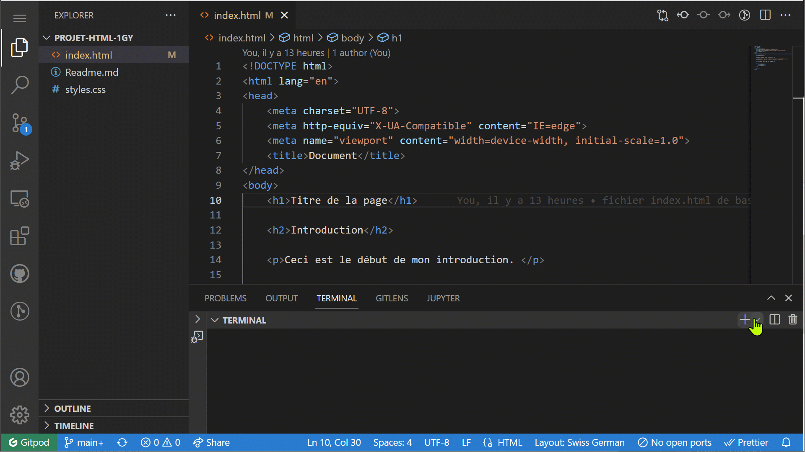
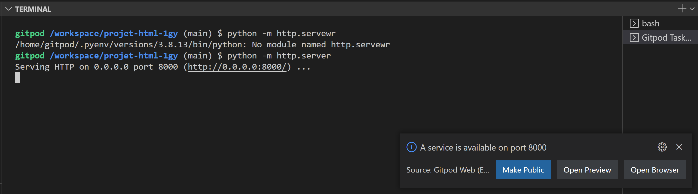
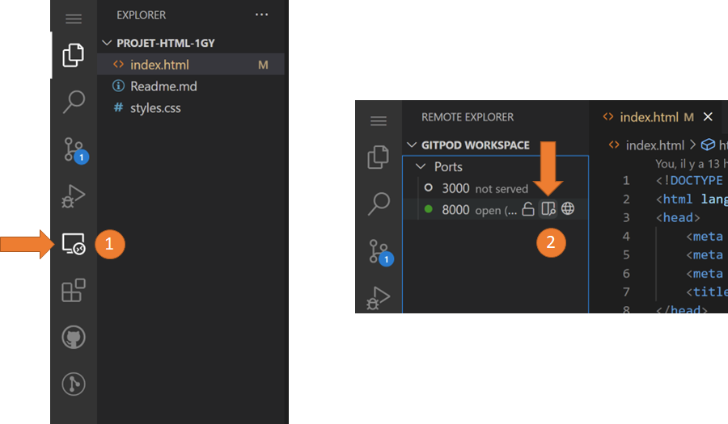

.. _git/editer-gitpod.rst:

Editer un dépôt Github sur gitpod
#################################

Une fois que vous avez créé votre dépôt sur Github, vous pouvez le modifier de
plusieurs manières.

* Directement sur Github (pas pratique du tout)
* En clonant le dépôt avec git sur votre machine locale et en poussant les
  modifications sur Github avec la commande ``git``.
* Utiliser un service Cloud tel que Gitpod.io (https://gitpod.io) pour modifier
  directement les fichiers du dépôt dans un environnement de développement Web.

Ouvrir le dépôt sur gitpod.io
=============================

Pour éditer les fichiers sur gitpod.io (basé sur Visual Studio Code), il faut
simplement procéder aux étapes suivantes:

#.  Vous rendre sur le dépôt à modifier sur Github (exemple :
    https://github.com/donnerc/presentation-film/)
 
#.  Rajouter le texte ``gitpod.io`` devant l'URL de votre dépôt dans la barre de
    navigation

    ..  figure:: figures/open-in-gitpod.png
        :align: center
        :width: 100%

        Ouverture du dépôt dans gitpod.io

Lancer le serveur de développement
==================================

Une fois le dépôt ouvert dans Gitpod.io, il faut lancer un serveur de
développement pour pouvoir consulter le rendu des fichiers HTML dans le
navigateur. Pour ce faire, entrez la commande suivante dans un **terminal**:

..  code-block:: bash

    python -m http.server 8080

Si le port 8080 est déjà utilisé, on peut remplacer le 8080 par un autre numéro
de port tel que 8081, 8000 ou 9000.

    Lancement du serveur et ouverture de la prévisualisation

Ouvrir la prévisualisation
==========================

Normalement, après avoir lancé le serveur avec la commande ``python -m
http.server 8080``, une boîte de dialogu devrait s'ouvrir. Il suffit de cliquer
sur **Open Preview**.

    Boîte de dialogue pour ouvrir la prévisualisation du site (page
    ``index.html``).

Il est possible que cette boîte de dialogue n'apparaisse pas. Dans ce cas, il
faut ouvrir la prévisualisation avec 

#.  Cliquer sur **Remote Explorer** dans le menu vertical de gauche

#.  Cliquer sur **Open Preview** (icône du milieu)

    Ouverture de la prévisualisation depuis le menu.

Modifier le code sur Gitpod
===========================

Une fois le dépôt ouvert dans gitpod, on peut ouvrir n'importe quel fichier et
le modifier. Dans l'extrait ci-dessous, on apporte une petite modification au
fichier ``index.html``.

Pour que les modifications soient prises en compte, il faut enregistrer le
fichier modifié avec le raccourci ``Ctrl + S``, puis il faut commiter ces
changements sur Github.

..  admonition:: Différence entre enregistrer et sauvegarder sur Github

    Lorsque vous faites ``Ctrl + S``, nous ne faites que d'enregister les
    modifications **en local**, sur gitpod. Cela permet notamment de voir le
    résultat des modifications dans un fichier HTML en raffraîchissant la page
    dans le navigateur.

    Les modifications ne sont cependant pas sauvegardées sur Github et ne sont
    donc pas sauvegardées pour de bon. Pour pousser les modifications sur
    Github, il faut encore les pousser sur Github.

Pousser les modifications sur Github
====================================

Pour que les modifications soient enregistrées définitivement dans Github, il
faut procéder aux trois étapes suivantes en exécutant les commandes indiquées
dans un terminal (créer un nouveau terminal si nécessaire):

..  admonition:: Ajouter les modifications à la **zone de transit** 

    ..  code-block:: bash

        git add .

        
..  admonition:: Faire un nouveau commit (point de restauration)

    Le but est de remplacer le message entre guillemets par un message qui
    décrit les changements effectués.

    ..  code-block:: bash

        git commit -m "description des modifications"

..  admonition:: Pousser les modifications sur Github

    Pour que les modifications se retrouvent sur GitHub et soient sauvegardées
    pour de bon, il faut encore pousser le commit sur Github avec 

    ..  code-block:: bash

        git push

    Il se peut que cette dernière étape refuse de s'exécuter et qu'il vous
    demande des permissions.

Sauvegarder les changements avec l'interface graphique
======================================================

..  admonition:: En cours de rédaction

    En cours de rédaction ...

Il est également possible de se passer des lignes de commandes ``git`` et
d'utiliser l'interface graphique pour effectuer ces trois commandes. Pour ce
faire, procédez comme suit:

